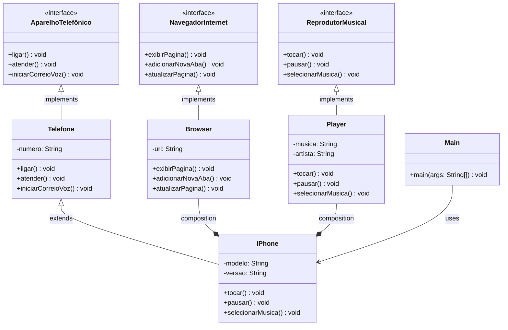

# Projeto POO - iPhone UML Exercise - Dio Bootcamp Java

Este projeto tem como objetivo modelar e implementar, em Java, o componente iPhone utilizando conceitos de Programação Orientada a Objetos (POO). O sistema simula as principais funcionalidades do iPhone, conforme apresentado no vídeo de lançamento de 2007:

- **Reprodutor Musical**: permite selecionar, tocar e pausar músicas.
- **Aparelho Telefônico**: possibilita ligar para números, atender chamadas e iniciar correio de voz, com validação de formato de número.
- **Navegador na Internet**: exibe páginas web, adiciona novas abas e atualiza páginas, com validação de URL.

O projeto utiliza interfaces para definir as funcionalidades e classes específicas para cada módulo (`Player`, `Telefone`, `Browser`), além da classe principal `Iphone` que integra todos os componentes. O programa possui interação via menu e histórico de ações.

# Diagrama UML - Mermaid

